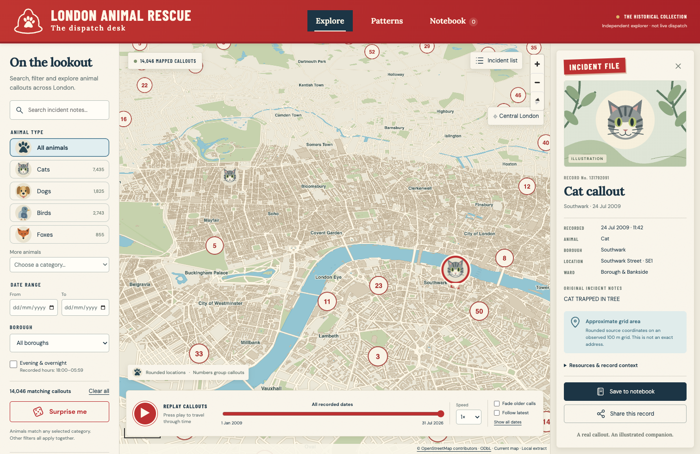

# London Animal Rescue

[](LICENSE)

A standalone historical explorer of animal-related incidents attended by the London Fire Brigade. Vite, strict TypeScript, MapLibre GL JS and plain HTML/CSS. No accounts, backend, runtime data service, paid tiles or runtime AI. This is an independent project, not an official LFB service or live dispatch application.

[](https://app.teinum.no/london-animal-rescue/)

[Open the dispatch desk](https://app.teinum.no/london-animal-rescue/)

## Run locally

Requires Node.js 22.12+ (tested with 22.22) and npm. The snapshots are included.

```sh
npm ci
npm run dev
```

Open http://127.0.0.1:5173. For production output:

```sh
npm run typecheck
npm test
npm run build
npm run preview
```

Preview defaults to http://127.0.0.1:4173. `dist/` is a static site. `.npmrc` uses `legacy-peer-deps` to avoid an npm 10 optional peer resolver crash with Vitest; the lockfile records the installed tree. Patched transitive dependencies are pinned through overrides.

## What works

- Geographically accurate pitched London map with local OSM water, roads, parks, place labels and optional central London building extrusions.
- Animal illustrations, clustered callouts, a selected rounded grid area, and a paginated cluster/list alternative.
- Description, ID and place search; multiple animal categories; inclusive date endpoints; borough; optional recorded evening/overnight hours (18:00–05:59).
- OR within the animal selection; AND between the other filter groups. Counts derive from the snapshot. Surprise chooses uniformly from the current filter matches.
- Incident files with original category and description, original identifier, recorded time, available place/resource fields, notional GBP cost estimates and precision explanations.
- Recorded chronological replay, pause, scrub, speed, older-call fading, follow-latest and gentle appearance pulses. No routes or invented operational activity.
- Versioned local notebook, removal, confirmed clearing, unavailable-ID handling and shareable incident/filter links with a copy fallback.
- Filtered animal, borough and pooled calendar-month counts, presented as accessible HTML tables with decorative in-cell bars.
- Responsive filter and incident sheets, reduced motion, keyboard controls, visible focus, live notices and a searchable list when WebGL/map assets fail.

## Data provenance and refreshing

Official page: https://data.london.gov.uk/dataset/animal-rescue-incidents-attended-by-lfb-2ogkn

The current page labels its download **“Animal Rescue incidents attended by LFB from Jan 2009.csv”**, but the actual download is an XLSX workbook ending `.csv.xlsx`. The source currently supplies **14,046 unique valid incident rows**, 1 January 2009 03:01 to 31 July 2026 22:32. All currently have usable rounded grid coordinates. There are no rejected rows or duplicate IDs in this snapshot. The source has 2,518 descriptions marked `Redacted`. These facts describe the bundled snapshot, not future refreshes.

Retrieved 12 September 2026. Exact retrieval time, official download URL, coverage, hash, categories and audit counts are in [public/data/provenance.json](public/data/provenance.json). The download is retained byte-for-byte as `data/source/lfb-download.bin`; its format is recorded, not inferred from the filename. The current official URL is:

https://data.london.gov.uk/download/2ogkn/01007433-55c2-4b8a-b799-626d9e3bc284/Animal%20Rescue%20incidents%20attended%20by%20LFB%20from%20Jan%202009.csv.xlsx

```sh
npm run data:refresh
# Rebuild from the already downloaded source, without network access:
npm run data:normalize
```

`curl` must be installed for refresh. The script first reads the official page and discovers its download link. It checks file signatures, reads XLSX with ExcelJS or CSV with Papa Parse, validates required headers and normalises the rows. It fails explicitly if download discovery, parsing or schema validation fails; it never generates substitute records. Routine builds do not refresh data. Review the provenance/rejection report after a refresh and run the tests and build before accepting a new snapshot. The normaliser refuses unexpectedly small snapshots (<1,000 valid rows).

UTF-8 (including BOM) and Windows-1252 CSV decoding are supported, with quoted commas, line breaks and escaped quotes. Empty/`NULL`/`N/A` fields become missing values. Currency strings have pounds signs, commas and whitespace removed before numeric validation. Invalid dates and missing IDs are reported and rejected. Duplicate IDs retain the first valid source row and report subsequent rows. Invalid/missing rounded coordinates do not discard a record: it remains in the list, with no invented position.

### Verified field mapping

The workbook has one incident sheet and 31 columns. **All 31 original source columns are retained** in the downloadable `public/data/source.csv`, including original geographic references and original place capitalisation. XLSX dates are exported as offset-free ISO civil timestamps. Source string contents and labels are not summarised. Normalised application fields are:

| Source column                                                                                                                                       | Application field / interpretation                                                   |
| --------------------------------------------------------------------------------------------------------------------------------------------------- | ------------------------------------------------------------------------------------ |
| `IncidentNumber`                                                                                                                                    | `id`, string, never a numeric counter                                                |
| `DateTimeOfCall`                                                                                                                                    | `date`, recorded civil timestamp; `clock`, arithmetic/order scalar                   |
| `AnimalGroupParent`                                                                                                                                 | `animal` unchanged except edge whitespace; `category` combines case variants         |
| `FinalDescription`                                                                                                                                  | `description`, plain text, including redactions                                      |
| `Borough`                                                                                                                                           | `borough`, case-normalised for filter matching                                       |
| `Ward`                                                                                                                                              | `ward`, recorded ward name                                                           |
| `PostcodeDistrict`                                                                                                                                  | `postcode`, explicitly a district, not a full postcode or sector                     |
| `Street`                                                                                                                                            | `street`, supplied street text; no inferred address                                  |
| `StnGroundName`                                                                                                                                     | `station`, recorded station ground                                                   |
| `Easting_rounded`, `Northing_rounded`                                                                                                               | Rounded grid location used by the map                                                |
| `Easting_m`, `Northing_m`, `Latitude`, `Longitude`                                                                                                  | Preserved in source CSV; paired values used for coordinate audit, not exact map pins |
| `PumpCount`                                                                                                                                         | `pumps`, count as supplied                                                           |
| `PumpHoursTotal`                                                                                                                                    | `pumpHours`, resource-hours, not elapsed rescue duration                             |
| `HourlyNotionalCost(£)`                                                                                                                             | `hourlyCost`, GBP per appliance-hour                                                 |
| `IncidentNotionalCost(£)`                                                                                                                           | `cost`, GBP notional estimate                                                        |
| `SpecialServiceType`                                                                                                                                | `service`, source service classification                                             |
| `PropertyType`                                                                                                                                      | `property`, recorded property context                                                |
| `CalYear`, `FinYear`, `TypeOfIncident`, `OriginofCall`, `PropertyCategory`, `SpecialServiceTypeCategory`, `WardCode`, `BoroughCode`, `UPRN`, `USRN` | Retained unchanged in source CSV                                                     |

Common animal icons are category illustrations. `Bird` is not renamed Pigeon. Pigeon and Budgie remain separate source categories, using the generic bird illustration. Foxes have their own category. All unsupported illustrations use a neutral paw, including unknown categories.

### Location precision and CRS

The public animal dataset page does **not** supply an explicit CRS, accuracy guarantee or rounding methodology; its “smallest geography” metadata says postcode sector despite the actual `PostcodeDistrict` and coordinate fields. The implementation follows the inspected data, not that coarse metadata label.

British National Grid / OSGB36 (EPSG:27700) is **inferred and cross-validated**, rather than falsely claimed as explicitly documented by the animal page. All 14,046 rounded eastings and northings end in 50, consistent with 100 m cell centres. Comparing 6,398 paired unrounded BNG and supplied latitude/longitude values yields median ~1.91 m and maximum ~3.05 m difference with the configured seven-parameter Helmert transformation. See `data/source/coordinate-audit.json` and `npm run data:audit`.

The CRS definition follows [Ordnance Survey’s coordinate system guide](https://www.ordnancesurvey.co.uk/documents/resources/guide-coordinate-systems-great-britain.pdf). `proj4` converts Airy/OSGB36 to WGS84 with the explicit Helmert parameters in `src/geo.ts`. This is a metre-level approximation, not the high-precision OSTN15 grid transformation. Its uncertainty is below the source grid scale.

Only rounded coordinates are used on the incident map, even when finer values exist. Selection highlights a 100 × 100 m square around the supplied grid centre; this illustrates observed spacing, **not a guaranteed uncertainty boundary**. No exact address is inferred and no coordinate jitter is used. Co-located records stay co-located and can be opened from a cluster’s paginated list. Missing grid coordinates would be left unmapped; this snapshot does not require centroid/boundary substitution. A few source boroughs are outside Greater London and remain included. The local map is most detailed in central London; some peripheral records can lie beyond detailed base coverage.

### Dates, outcomes and costs

No timezone or DST convention is documented on the public page or in the workbook. Dates are shown as **recorded clock values**, without an invented `Z`, UTC label or Europe/London conversion. Excel serials are interpreted as civil values; the JS UTC constructors in `dates.ts` are only a timezone-independent arithmetic device. The `clock` scalar is **not an asserted UTC instant**. Ambiguous autumn hours cannot be disambiguated, and unknown spring conventions are not corrected. Equal timestamps are stably ordered by incident ID.

LFB does not routinely record animal death/injury outcomes in this dataset. The app preserves descriptions and does not infer rescue success. `Redacted` is shown as source redaction.

Costs are **notional cost estimates in GBP**. Per the source, appliance attendance time is rounded up to the next hour for Pump, Aerial and FRU appliances and multiplied by the Brigade hourly rate. These are neither invoices, exact expenditure nor amounts charged to owners. Resource-hours are not elapsed rescue duration or response time. No “most expensive animal” rankings are provided.

## Replay semantics

- Initially all filter matches are visible. Play restarts at the first matched recorded timestamp.
- At 1×, a real elapsed second advances 30 recorded days; ¼×, 4× and 12× scale that rate.
- A monotonic elapsed clock drives playback, not a frame counter. The UI batches updates approximately every 150 ms.
- Scrubbing clamps to the available range and pauses. Filter/date changes pause and reset to all matching dates. Speed/fade/follow changes retain the cursor.
- Cumulative calls are retained through the cursor. Fade dims calls older than 30 recorded days (clusters use their newest member).
- New recorded calls pulse gently; follow-latest selects the most recent newly crossed event and pans only if necessary. Intermediate calls still enter the map even if several timestamps are crossed in a tick.
- Reaching the end stops playback. Selecting a record pauses; a selected record outside the replay window is explicitly identified.
- Hidden tabs pause immediately and remain paused on return. No hidden-time backlog is replayed. Reduced motion disables pulses and animated camera movement.

## Map sources and configuration

There are **no external runtime map requests**. `src/map.ts` serves the bundled GeoJSON and original illustrations using base-aware local URLs. Place/cluster labels are drawn into local canvas images; no remote glyph service is used. MapLibre’s worker is bundled with Vite `?worker&url`, including its dependencies.

[OpenStreetMap](https://www.openstreetmap.org/copyright) data was retrieved via https://overpass-api.de/api/interpreter using the exact bounded query in `scripts/london.overpass`.

```sh
npm run map:refresh
# With an existing ignored raw OSM download:
npm run map:refresh -- --local
```

The query requests main roads, water and parks across the bounding box 51.28–51.71 N, −0.53–0.34 E; more local streets around the centre; buildings around 51.49–51.53 N, −0.17–−0.07 E. `osmtogeojson` assembles relation geometry, including the Thames. The transformation retains the selected feature geometry with coordinates rounded to 5 decimal places. The raw OSM response is large and gitignored; derived GeoJSON and the reproducible query/transformation are included under ODbL. `public/map/provenance.json` records the OSM timestamp and coverage. This is a present-day base, not historical street mapping.

Buildings load only at zoom ≥12.5 and extrude from zoom 13, using recorded `height` or an explicitly estimated `building:levels × 3 m`; buildings without height information remain flat. No invented landmark coordinates or miniature-city distortions. Three.js adds no useful capability here and is not included.

The uncompressed local map base is approximately 30 MB; buildings add approximately 11 MB only when requested. Use HTTP Brotli/gzip compression when hosting static files. This bounded approach trades initial download weight for no tile API, account, usage-policy dependency or third-party runtime requests. Map rendering remains in workers; records and the list load independently. A vector-tile/PMTiles conversion is a reasonable future optimisation. Preserve attribution and ODbL obligations if changing map providers.

## Licensing and assets

The application code and original documentation are licensed under the [MIT License](LICENSE), copyright © 2026 Morten Teinum. Bundled data, fonts, dependencies and separately licensed artwork retain their own terms; see [THIRD_PARTY_NOTICES.md](THIRD_PARTY_NOTICES.md).

- **Incident data:** London Fire Brigade / London Datastore, [Open Government Licence v3.0](https://www.nationalarchives.gov.uk/doc/open-government-licence/version/3/). Contains public sector information licensed under the Open Government Licence v3.0. Include attribution and the licence link with redistributed data. No endorsement is implied.
- **Map database:** © OpenStreetMap contributors, [ODbL 1.0](https://opendatacommons.org/licenses/odbl/1-0/). Preserve visible map attribution and provide the derived database or its derivation under the licence. The included GeoJSON, query and conversion script support that obligation.
- **Animal illustrations and helmet/paw mark:** original SVG paths authored for this application, reproducibly generated by `scripts/create-art.mjs`. Reusable assets, with no third-party animal photographs. These original visual assets are released under CC0; see `public/art/README.md`.
- **Typography:** Barlow Condensed, DM Sans and Lora from Fontsource, SIL Open Font Licence. Fonts are bundled locally. Licence notices are in `public/licenses/`.
- **MapLibre:** BSD-3-Clause; dependency licences remain with their packages.

## Architecture

`src/app.ts` exports `mount(root: HTMLElement): () => void`. It returns cleanup synchronously; asynchronous initialisation is abortable. Cleanup aborts fetches, removes event listeners, clears timers, disconnects resize observation and removes MapLibre/markers. Importing the mount function does not create a map or touch the DOM until called.

| Module                                            | Responsibility                                                                         |
| ------------------------------------------------- | -------------------------------------------------------------------------------------- |
| `scripts/refresh-data.ts`, `scripts/normalize.ts` | Download, file format detection, source parsing, validation, normalisation, provenance |
| `src/types.ts`, `src/dates.ts`, `src/geo.ts`      | Data contracts, recorded civil time, grid conversion/area                              |
| `src/filters.ts`                                  | Pure combined filter predicate                                                         |
| `src/map.ts`                                      | Lazy MapLibre setup, geographic layers, clustering, selection, pulses                  |
| `src/timeline.ts`                                 | Pure replay state and elapsed-time advancement                                         |
| `src/notebook.ts`, `src/url-state.ts`             | Defensive persistence and validated URL state                                          |
| `src/patterns.ts`                                 | Filtered count tables/bars                                                             |
| `src/ui.ts`, `src/app.ts`, `src/style.css`        | DOM helpers, interface orchestration and layout                                        |

## Subdirectory hosting

Relative base URLs (`./`) are the default and all public data/art URLs use Vite’s base. For a known mount path:

```sh
BASE_PATH=/london-animal-rescue/ npm run build
BASE_PATH=/london-animal-rescue/ npm run preview
```

Serve `dist/` at `/london-animal-rescue/` with the trailing slash. Shares use query parameters at the same path; no SPA path rewrite is needed. The build bundles its worker correctly for this base. `BASE_PATH` is a build-time setting; rebuild when it changes. The default relative base requires the document to be served from its directory URL, not an invented nested route.

## Deployment

The GitHub Actions **Build** workflow tests and builds every pull request and push to `main`. Successful main builds deploy to **https://app.teinum.no/london-animal-rescue/** using the same cPanel SSH/rsync approach as Space Rocks. Builds use the committed incident and map snapshots. Apache configuration enables compression for the large JSON/GeoJSON assets.

See [docs/deployment.md](docs/deployment.md) for repository settings, host verification, publication behaviour and troubleshooting.

## Validation

```sh
npm run typecheck
npm test
npm run build
# In another terminal while npm run dev is running:
npm run test:browser
```

The browser tests require a Playwright Chromium installation (`npx playwright install chromium` if missing). They run desktop and mobile Chromium. See `docs/VALIDATION.md` for the checks actually performed and their practical limits. Tests use small explicitly synthetic fixtures only for edge cases; the application snapshot is entirely official data.

## Social graphics

- [Illustrated link preview, 1734 × 907](public/social/london-animal-rescue-v2.png): used by the page's Open Graph and Twitter/X card metadata.
- [Illustrated square post, 1254 × 1254](public/social/london-animal-rescue-square-v2.png): for manual sharing.

These detailed promotional illustrations were created during development with the built-in image-generation tool. They depict an editorial London skyline montage and generic animals, not a geographic map or photographs of actual incidents. [Artwork notes and generation prompts](public/social/README.md) document their origin. Normal builds use the committed PNGs and make no AI requests. Versioned filenames distinguish the new previews from cached older artwork.

The earlier flat vector cards remain available; `npm run art:social` regenerates only those legacy cards using Playwright Chromium and `scripts/create-social-art.mjs`. Metadata in `index.html` uses absolute URLs for the deployed site; update those URLs if hosting at a different address. Shared incident links use the same application-level preview because this is a static site.

## Contact

Morten Teinum — [morten@teinum.no](mailto:morten@teinum.no)
